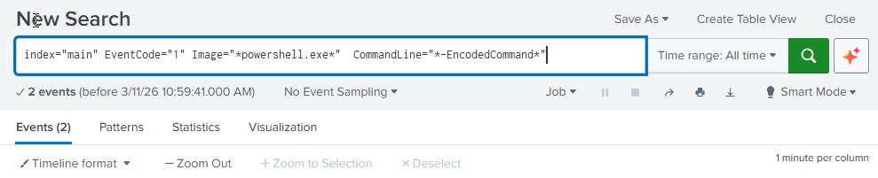
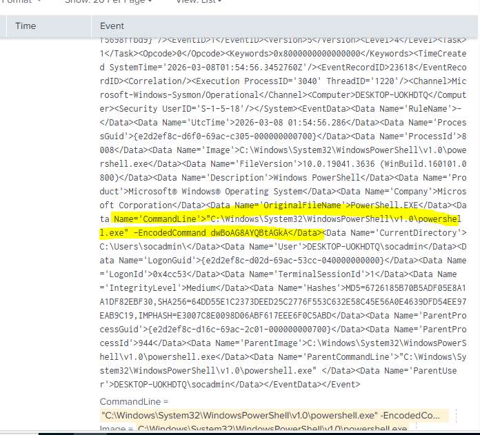

# Encoded PowerShell Execution

## Description

Encoded PowerShell commands are commonly used by attackers to obfuscate malicious scripts.

PowerShell may also be used to download and run executables from the Internet, which can be executed from disk or in memory without touching disk.

This technique is frequently used in malware and post-exploitation frameworks.

MITRE ATT&CK Technique:
**T1059.001 – PowerShell**

Supporting Technique:

T1132 – Data Encoding

---

## Attack Simulation

The following command was executed on the Windows machine:

powershell -EncodedCommand dwBoAG8AYQBtAGkA

This command executes the encoded PowerShell command.

---

## Detection

Splunk query:

index=main EventCode="1" Image="*powershell.exe*" CommandLine="*-EncodedCommand*"

**EventCode=1** confirms a process was created.

**Image="powershell.exe"** confirms the process was PowerShell.

**CommandLine="-EncodedCommand"** confirms the encoded execution parameter was used.

---

## Evidence

**$command="whoami"**-stores the command as a string in variable $command.
**$bytes = [System.Text.Encoding]::Unicode.GetBytes($command)** - this line takes the text stored in $command and coverts it into bytes using unicode encoding. $Bytes is then a Unicode byte array

**$encoded=[Convert]::ToBase64String($bytes)** -converst byte array into Base64-encoded string which can be later passed to powershell using -EncodedCommand

---

## Analysis

The command line included the parameter "-EncodedCommand", indicating an attempt to execute an obfuscated PowerShell command.

Such behavior is commonly associated with malicious scripts and living-off-the-land attacks.

The log produced by sysmon visualized in Splunk shows the execution of an encoded command

---

## Alert
Alert Configuration

An alert was created in Splunk using the same SPL query.

Alert configuration:

Trigger condition: Results > 0

Time range: Last 5 minutes

Action: Add to Triggered Alerts

Action: Email notification

---

## Mitigation

Possible defensive measures include:

- M1049: Antivirus/Antimalware: Automatically quarantine suspicious files
- M1045: Code Signing: Set Execution policyin powershell to only signed scripts
- M1042: Disable or Remove Feature or Program: It may be possible to remove PowerShell from systems when it is not needed
- M1038	Execution Prevention: PowerShell Constrained Language mode can be used to restrict access to sensitive or otherwise dangerous language elements
- M1026	Privileged Account Management: When PowerShell is necessary, consider restricting PowerShell execution policy to administrators. PowerShell JEA (Just Enough Administration) may also be used to sandbox administration and limit which commands are allowed.
