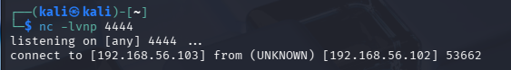
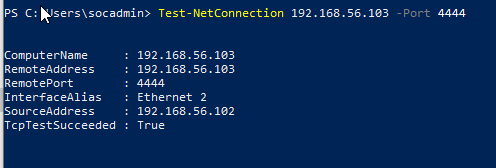
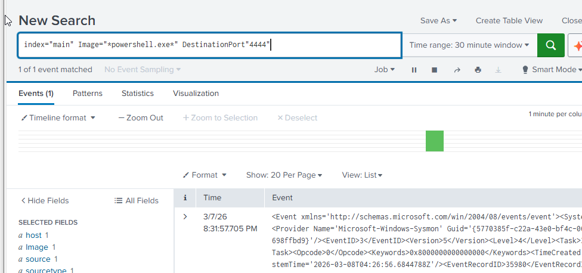
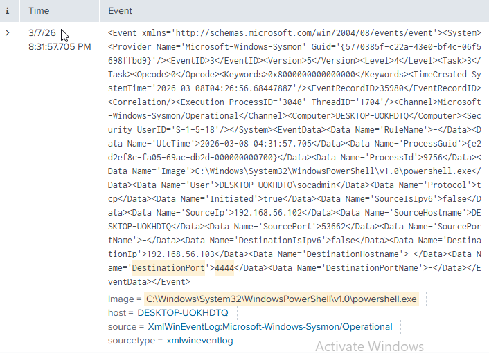

# Suspicious Outbound Network Connection

## Description

Suspicious outbound network connections are commonly associated with command-and-control (C2) communication.

After gaining initial access to a system, attackers often establish outbound connections to remote servers in order to:

- Receive commands
- Exfiltrate data
- Download additional malicious payloads

Because outbound traffic is often allowed by default in many networks, attackers frequently use this channel to maintain communication with compromised hosts.

Monitoring unusual or unauthorized outbound connections is therefore an important detection strategy in Security Operations Centers (SOC).

MITRE ATT&CK Technique:  
**T1071 – Application Layer Protocol**

---

## Attack Simulation

To simulate suspicious outbound communication, a connection was established between the Windows machine and the Kali Linux attacker machine using Netcat.

On the Kali Linux system a listener was started:

nc -lvnp 4444

On the Windows system the following command was executed to initiate the connection:

nc 198.168.56.103 4444

198.168.56.103 being the kali ip address. 

This simulates a compromised host establishing a connection to a remote command-and-control server.

---

## Detection

Splunk query:

index=main Image="*powershell.exe*" DestinationPort="4444" 

This query searches for **Sysmon network connection events**.

Sysmon Event ID 3 logs outbound network connections including:

- Source process
- Destination IP address
- Destination port

---

## Evidence

The network connection from the Windows host to the Kali Linux machine.

---

## Analysis

Sysmon generated **Event ID 3**, which indicates a network connection initiated by a process on the system.

The log shows that a process initiated a connection to an external IP address on port **4444**, which is commonly used in penetration testing tools and reverse shells.

Monitoring outbound connections is important because compromised hosts frequently communicate with attacker-controlled infrastructure.

In a real-world scenario, analysts would investigate:

- Whether the destination IP address is known or malicious
- Whether the port used is commonly associated with command-and-control activity
- Which process initiated the connection

---

## Alert

An alert was created in Splunk using the same SPL query to detect suspicious outbound network connections.

Alert configuration included:

- Trigger condition: Results greater than 0
- Alert frequency: Every 5 minutes
- Action: Add to triggered alerts in Splunk
- Action: Send email notification

This alert allows SOC analysts to detect potential command-and-control communication from compromised hosts.

---

## Mitigation

Defensive measures listed in MITRE ATTACK include:

- M1037	Filter Network Traffic: Use network appliances to filter ingress or egress traffic and perform protocol-based filtering. 

- M1031	Network Intrusion Prevention: Network intrusion detection and prevention systems that use network signatures to identify traffic for specific adversary malware at the network level.

