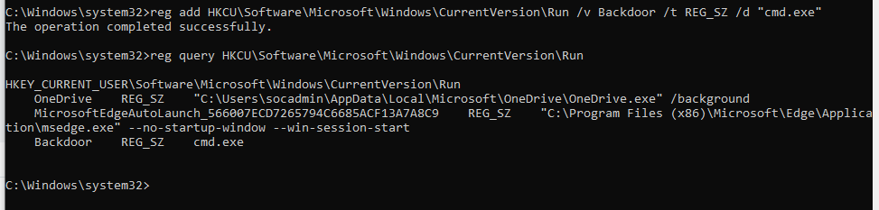
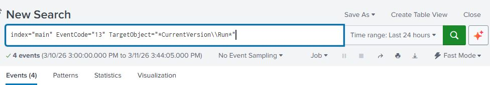
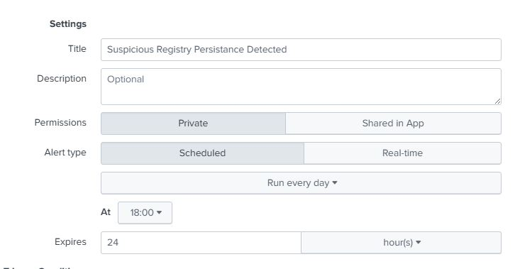
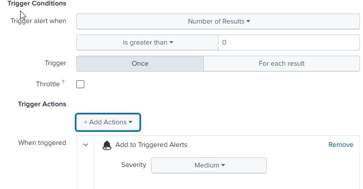

# Registry Persistence

## Description

Registry Run Keys are commonly used by attackers to establish persistence on a compromised system.

Adding an entry to the "run keys" in the Registry or startup folder will cause the program referenced to be executed when a user logs in. These programs will be executed under the context of the user and will have the account's associated permissions level.

By adding a value to the Windows registry under the **CurrentVersion\Run** key, an attacker can ensure their malicious program is executed each time the user logs in.

This technique is used by malware to maintain long-term access to a compromised system.

MITRE ATT&CK Technique:
**T1547.001 – Boot or Logon Autostart Execution: Registry Run Keys / Startup Folder**

---

## Attack Simulation

The following command was executed on the Windows machine:
**reg add HKCU\Software\Microsoft\Windows\CurrentVersion\Run /v Backdoor /t REG_SZ /d "cmd.exe"**

---

## Evidence

The registry persistence command executed successfully on the Windows system.

**reg add HKCU\Software\Microsoft\Windows\CurrentVersion\Run /v Backdoor /t REG_SZ /d "cmd.exe"** - adds a registry value named Backdoor that runs cmd.exe at startup

**reg query HKCU\Software\Microsoft\Windows\CurrentVersion\Run"** -queries the contents in the registry since Backdoor is in it we know the registry value was added successfully.

---

## Detection

Splunk query:

index=main EventCode=13 TargetObject="*CurrentVersion\\Run*"

**EventCode=13** confirms a registry value was created or modified.

**TargetObject="CurrentVersion\Run"** confirms the affected registry path is a known persistence location

This query searches Sysmon registry modification events that target the **Run key**, which is commonly abused for persistence.

## Analysis

The Sysmon Event ID 13 log indicates that a registry value was created under the CurrentVersion\Run key.

This registry location is commonly abused by attackers to establish persistence because programs listed in this key are automatically executed when the user logs in.

The event shows that reg.exe modified the registry and added a value named Backdoor, configured to execute cmd.exe.

This behavior matches the persistence technique T1547.001 – Registry Run Keys from the MITRE ATT&CK framework.

---

## Alert

An alert was created in Splunk using the same SPL query to identify registry persistence activity.

**Alert Configuration**

An alert was created in Splunk using the same SPL query.

Alert configuration:

Alert Name: Encoded powershell execution detected

Alert Type :Scheduled everyday at 12:00

Trigger condition: Results > 0, trigger only once

Action: Add to Triggered Alerts

This alert allows SOC analysts to detect when suspicious registry persistence mechanisms are created.

---

## Mitigation
Althought this type of attack technique cannot be easily mitigated with preventive controls since it is based on the abuse of system features it can be detected and therefore contained and erased.

## Detection Strategy
MITRE ATT&CK recommends correlating registry persistence events with subsequent process execution and suspicious file paths.

In this lab environment, a basic detection strategy was implemented that monitors registry modifications under the Run key.

More advanced detections may correlate registry modifications with process execution events and abnormal parent-child relationships to identify malicious persistence mechanisms (DET0365	Detect Registry and Startup Folder Persistence (Windows)).
