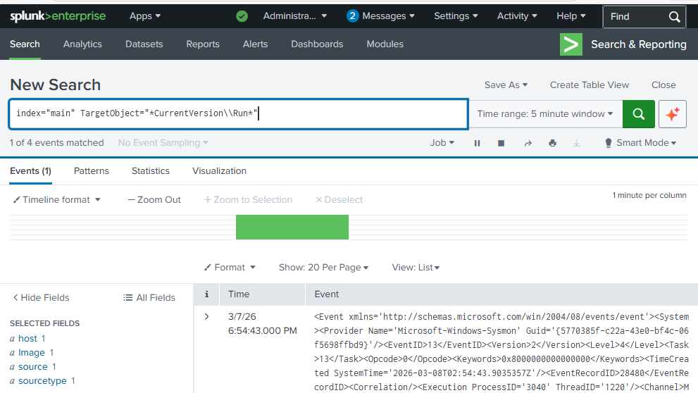
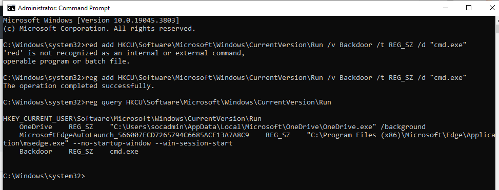
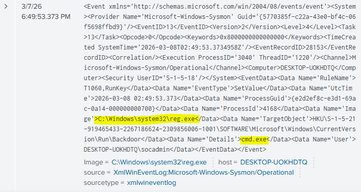

# Registry Persistence

## Description

Registry Run Keys are commonly used by attackers to establish persistence on a compromised system.

Adding an entry to the "run keys" in the Registry or startup folder will cause the program referenced to be executed when a user logs in. These programs will be executed under the context of the user and will have the account's associated permissions level.

By adding a value to the Windows registry under the **CurrentVersion\Run** key, an attacker can ensure their malicious program is executed each time the user logs in.

This technique is used by malware to maintain long-term access to a compromised system.

MITRE ATT&CK Technique:
**T1547.001 – Boot or Logon Autostart Execution: Registry Run Keys / Startup Folder**

---

## Attack Simulation

The following command was executed on the Windows machine:
**reg add HKCU\Software\Microsoft\Windows\CurrentVersion\Run /v Backdoor /t REG_SZ /d "cmd.exe"**

## Detection

Splunk query:

index=main TargetObject="CurrentVersion\Run"

This query searches Sysmon registry modification events that target the **Run key**, which is commonly abused for persistence.

---

## Evidence

The registry persistence command executed successfully on the Windows system.

---

## Analysis

Sysmon generated the log, which indicates a registry value modification.

The event shows that a new registry value was added to the **CurrentVersion\Run** key, which is commonly used by malware to establish persistence.

By placing a program in this location, the operating system will automatically execute it whenever the user logs in.

---

## Alert

An alert was created in Splunk using the same SPL query to identify registry persistence activity.

Alert configuration included:

- Trigger condition: Results greater than 0
- Alert frequency: Every 5 minutes
- Action: Add to triggered alerts in Splunk
- Action: Send email notification

This alert allows SOC analysts to detect when suspicious registry persistence mechanisms are created.

---

## Mitigation
Althought this type of attack technique cannot be easily mitigated with preventive controls since it is based on the abuse of system features it can be detected and therefore contained and erased.

## Detection Strategy
MITRE ATT&CK recommends correlating registry persistence events with subsequent process execution and suspicious file paths.

In this lab environment, a basic detection strategy was implemented that monitors registry modifications under the Run key.

More advanced detections may correlate registry modifications with process execution events and abnormal parent-child relationships to identify malicious persistence mechanisms (DET0365	Detect Registry and Startup Folder Persistence (Windows)).
