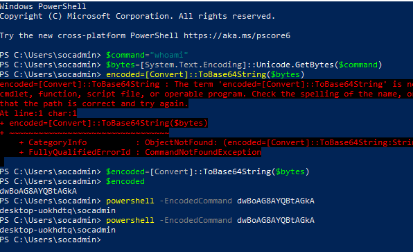

# Incident Report – Encoded PowerShell Execution

## Incident Overview

An alert was triggered in the SOC lab environment indicating that PowerShell executed a command using the **EncodedCommand** parameter.

Encoded PowerShell commands are commonly used by attackers to obfuscate malicious scripts and evade detection mechanisms.

The activity was detected through Sysmon telemetry ingested into Splunk.

---

## Detection Rule

Splunk SPL query used for detection:

index=main EventCode=1 Image="powershell.exe" CommandLine="-EncodedCommand"

This query searches Sysmon process creation logs for PowerShell commands containing the **EncodedCommand parameter**, which indicates Base64 encoded execution.

---

## Affected System

Windows 10 Virtual Machine – SOC Detection Lab

Monitoring Tools:

- Sysmon
- Splunk SIEM

---

## Timeline of Activity

| Time | Event |
|-----|------|
| 19:22:10 | Encoded PowerShell command executed on Windows host |
| 19:22:11 | Sysmon logged process creation event (Event ID 1) |
| 19:22:11 | Splunk detection query matched encoded command execution |

*Note: Timestamps correspond to events observed in Splunk logs.*

---

## Evidence

Encoded PowerShell command execution:

Splunk detection evidence:

---

## MITRE ATT&CK Mapping

Primary Technique:

T1059.001 – Command and Scripting Interpreter: PowerShell

Supporting Technique:

T1132 – Data Encoding

Framework Reference:

MITRE ATT&CK

---

## Investigation Summary

The investigation confirmed that PowerShell executed a command using the **EncodedCommand parameter**, which allows commands to be executed in Base64 format.

This technique is commonly used by attackers to obfuscate malicious scripts and evade detection mechanisms.

Sysmon Event ID 1 captured the process creation event and recorded the full command line executed by PowerShell.

The detection rule successfully identified the suspicious command execution within the environment.

---

## Conclusion

The detection rule correctly identified encoded PowerShell execution within the SOC lab environment.

Although the command executed in this simulation was benign (`whoami`), similar behavior is commonly associated with malicious scripts used during post-exploitation activities.

This demonstrates the effectiveness of using Sysmon telemetry combined with SIEM-based detection rules to identify suspicious PowerShell activity.

---

## Recommended Mitigations

- Monitor and alert on encoded PowerShell execution
- Restrict PowerShell execution policies where possible
- Implement application control for script execution
- Monitor abnormal PowerShell command-line activity
