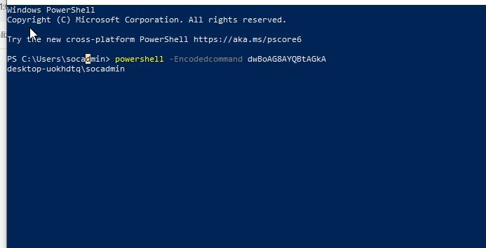
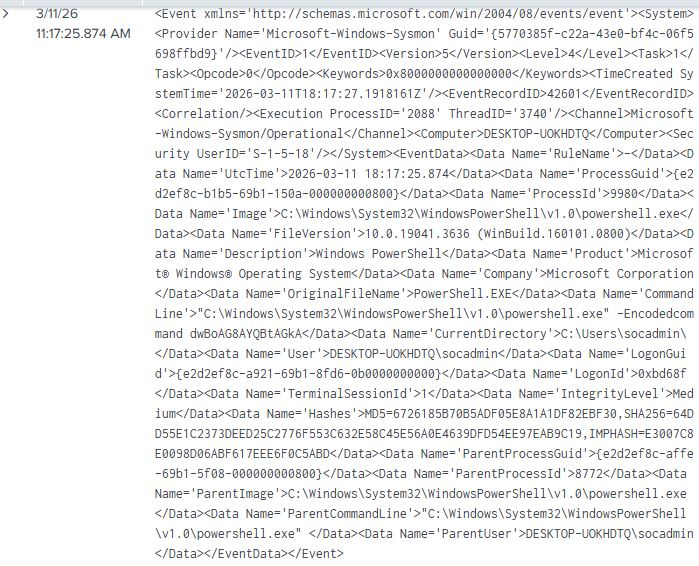
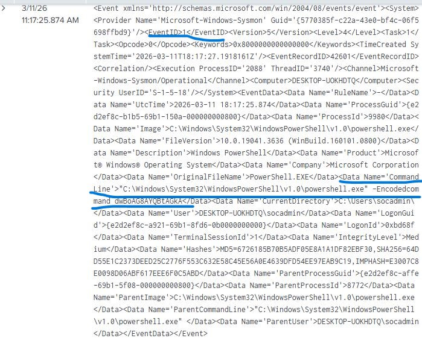
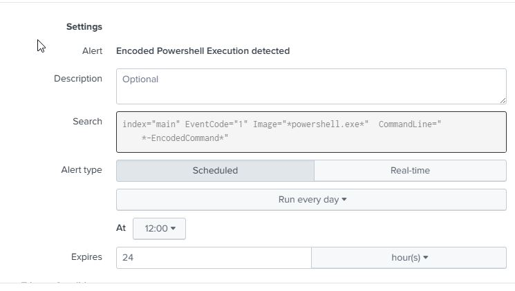
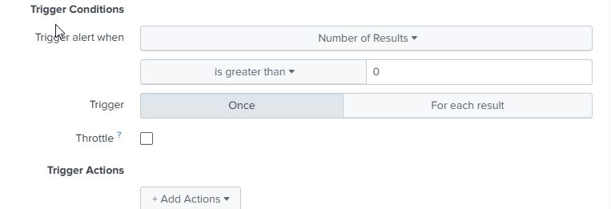
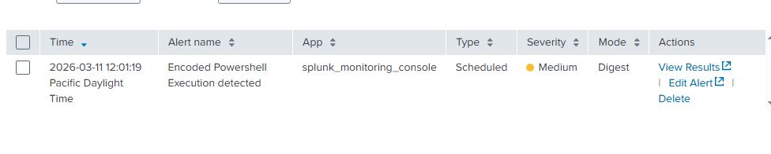

# Incident Report – Encoded PowerShell Execution

## Executive Summary

During the SOC lab exercise, encoded PowerShell execution was identified on the monitored Windows 10 virtual machine through Sysmon process creation telemetry ingested into Splunk.

After the activity was generated, the corresponding Sysmon event was reviewed manually in Splunk to confirm that the telemetry had been captured correctly. Based on this observed behavior, a custom SPL detection rule was developed to identify PowerShell executions that used the `-EncodedCommand` parameter.

The rule was then used to create a scheduled Splunk alert to detect similar behavior in future events. When the alert ran, it successfully triggered on the matching event, validating the detection logic and alert configuration.

---

## Alert Details

**Alert Name:** Encoded PowerShell Execution Detected

Trigger Logic: Results greater than 0 within the configured alert time window, trigger only once. When triggered it will be added to triggered alerts.

Affected Type: Scheduled Everyday at 12:00


**Detection Query:**

```spl
index=main EventCode="1" Image="*powershell.exe*" CommandLine="*-EncodedCommand*"
```

## Timeline of Activity

| Time | Event |
|-----|------|
| 11:17:00 | Encoded PowerShell command executed on Windows host |
| 11:17:11 | Sysmon logged process creation event (Event ID 1) |
| 11:18:19 | Manual Splunk search confirmed the event matched the detection logic|
| 12:01:19 | Scheduled Splunk alert triggered on the matching encoded PowerShell event |

## Investigation Steps

1. Executed the encoded PowerShell command on the Windows endpoint.

2. Reviewed the resulting Sysmon Event ID 1 process creation event in Splunk.

3. Confirmed that the command line included the -EncodedCommand parameter.

4. Verified that the custom SPL query matched the observed event.

5. Allowed the scheduled alert to run and confirmed it triggered on the same activity.

## Findings

The investigation confirmed that PowerShell executed an encoded command on the monitored endpoint.

The activity first appeared as a Sysmon Event ID 1 process creation log in Splunk, where it was manually reviewed to confirm that the telemetry had been ingested successfully and matched the intended detection logic.

After this validation step, the scheduled Splunk alert triggered on the same event, demonstrating that the alert configuration was functioning correctly and that similar encoded PowerShell activity could be detected automatically in future events.

## Evidence Reviewed

Encoded PowerShell command execution:



Splunk detection result:




Splunk alert configuration:





Splunk alert triggered:



## MITRE ATT&CK Mapping

Primary Technique:
T1059.001 – Command and Scripting Interpreter: PowerShell

Supporting Technique:
T1132 – Data Encoding

## Outcome

The detection rule and alert successfully identified the simulated encoded PowerShell activity.

No containment actions were required because the event was part of a controlled lab exercise. However, the alert logic is suitable for identifying similar PowerShell behavior in future events.
