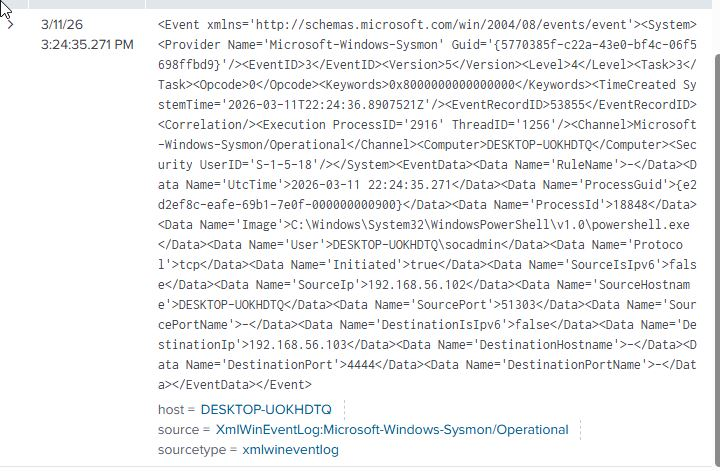
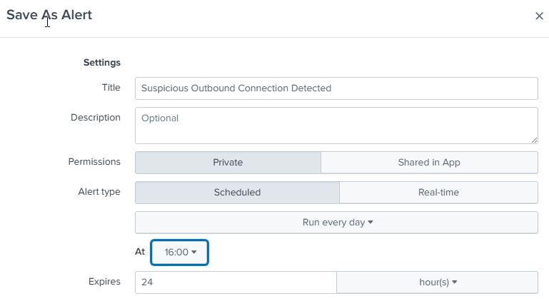
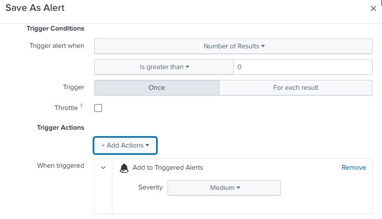
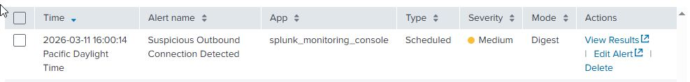

# Incident Report – Suspicious Outbound Network Connection

## Executive Summary

During the SOC lab exercise, suspicious outbound network communication was identified on the monitored Windows 10 virtual machine through Sysmon network connection telemetry ingested into Splunk.

After the activity was generated, the corresponding Sysmon event was reviewed manually in Splunk to confirm that the telemetry had been captured correctly. Based on this observed behavior, a custom SPL detection rule was developed to identify outbound connections to the destination port used during the simulation.

The rule was then used to create a scheduled Splunk alert to detect similar behavior in future events. When the alert ran, it successfully triggered on the matching event, validating the detection logic and alert configuration.

---

## Alert Details

**Alert Name:** Suspicious Outbound Connection Detected

Trigger Logic: Results greater than 0 within the configured alert time window, trigger only once. When triggered it will be added to triggered alerts.

Affected Type: Scheduled Everyday at 16:00

**Detection Query:**

```spl
index=main EventCode="3" DestinationPort="4444"
```

## Investigation Steps

Initiated the outbound connection from the Windows endpoint to the Kali listener.

Reviewed the resulting Sysmon Event ID 3 network connection event in Splunk.

Confirmed that the event showed the expected destination IP and destination port.

Verified that the custom SPL query matched the observed event.

Allowed the scheduled alert to run and confirmed it triggered on the same activity.

## Findings

The investigation confirmed that the monitored Windows endpoint initiated an outbound network connection to the Kali system used in the lab environment.

The activity first appeared as a Sysmon Event ID 3 network connection log in Splunk, where it was manually reviewed to confirm that the telemetry had been ingested successfully and matched the intended detection logic.

After this validation step, the scheduled Splunk alert triggered on the same event, demonstrating that the alert configuration was functioning correctly and that similar outbound connection activity could be detected automatically in future events.

## Evidence Reviewed

Outbound connection command execution:


Splunk detection result:



Splunk alert configuration:




Splunk alert triggered:



## MITRE ATT&CK Mapping

Primary Technique:
T1071 – Application Layer Protocol

Supporting Context:
The simulated activity represents outbound communication from a monitored endpoint to an attacker-controlled system, which can resemble command-and-control behavior in real environments.

## Outcome

The detection rule and alert successfully identified the simulated suspicious outbound network connection.

No containment actions were required because the event was part of a controlled lab exercise. However, the alert logic is suitable for identifying similar suspicious outbound communication in future events.
