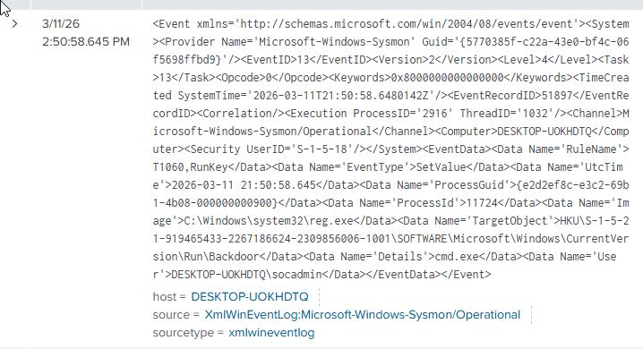
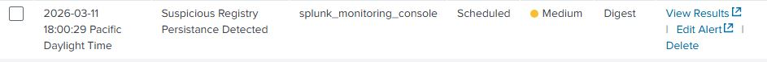

# Incident Report – Registry Persistence

## Executive Summary

During the SOC lab exercise, registry-based persistence activity was identified on the monitored Windows 10 virtual machine through Sysmon registry modification telemetry ingested into Splunk.

After the activity was generated, the corresponding Sysmon event was reviewed manually in Splunk to confirm that the telemetry had been captured correctly. Based on this observed behavior, a custom SPL detection rule was developed to identify modifications to the Windows `CurrentVersion\Run` registry key, a common persistence location used to achieve execution at user logon. The rule was then operationalized as a Splunk alert to detect similar behavior in future events.

The alert was successfully validated against the simulated activity and confirmed to function as expected.

---

## Detection Development

**Detection Rule Name:** Registry Persistence Run Key Detected

**Detection Query:**

```spl
index=main EventCode=13 TargetObject="*CurrentVersion\\Run*"
```

This query searches Sysmon registry modification events for changes affecting the Windows CurrentVersion\Run key, which is commonly abused to establish persistence.

## Alert Details

**Alert Name:** Suspicious Registry Persistance Detected

Trigger Logic: Results greater than 0 within the configured alert time window, trigger only once. When triggered it will be added to triggered alerts.

Affected Type: Scheduled Everyday at 18:00


## Timeline of Activity

| Time | Event |
|-----|------|
| 14:50:00 | Encoded PowerShell command executed on Windows host |
| 14:50:58 | Sysmon logged process creation event (Event ID 1) |
| 14:51:19 | Manual Splunk search confirmed the event matched the detection logic|
| 18:00:29 | Scheduled Splunk alert triggered on the matching encoded PowerShell event |

## Validation Steps

1. Simulated registry persistence on the Windows endpoint by creating a Run key entry.

2. Reviewed the resulting Sysmon Event ID 13 registry modification event in Splunk.

3. Confirmed that the TargetObject field referenced the CurrentVersion\Run registry path.

4. Verified that the registry value added would execute cmd.exe at user logon.

5. Allowed the scheduled alert to run and confirmed it triggered on the same activity.

## Findings

The investigation confirmed that a registry value was added under the Windows CurrentVersion\Run key on the monitored endpoint.

The event matched the expected lab simulation and demonstrated that Sysmon registry telemetry provided sufficient visibility to identify persistence-related registry changes.

The custom SPL detection rule and resulting alert successfully identified the activity, showing that the detection logic was functioning correctly.

## Evidence Reviewed

Registry persistence command execution:


Splunk detection result:



## Splunk alert configuration:


## Splunk alert triggered:



## MITRE ATT&CK Mapping

Primary Technique:
T1547.001 – Boot or Logon Autostart Execution: Registry Run Keys / Startup Folder

## Outcome

The detection rule and alert successfully identified the simulated registry persistence activity.

No containment actions were required because the event was part of a controlled lab exercise. However, the alert logic is suitable for identifying similar persistence behavior in future events.
